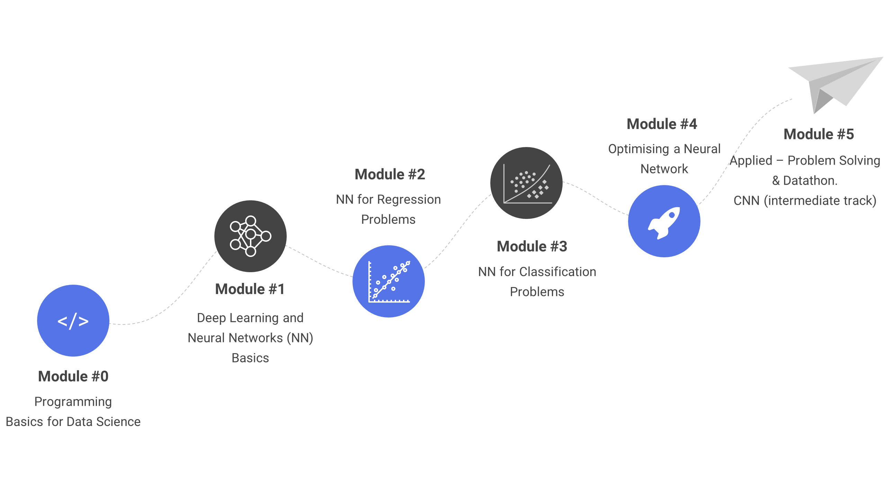

# Dphi : Deep Learning Online Bootcamp

# Overview
__Deep Learning Online Bootcamp
Learn from industry experts for free
Ongoing (20th Aug - 6th Sep'20)__

An immersive community learning experience designed for beginners and intermediate learners

| Period | Modules | Live Sessions | Quizes/Assignments | Datathon |
| :---: | :---: | :---: | :---: | :---: |
| 18 days bootcamp | 15 learning modules | 5 live sessions | 6 quizzes/assignments | 1 Datathon on real-world dataset | 

__What you will Learn__

# Contents

## Courses

### Course Materials Contents  

| Day   | Description                           | Slides | PDF | Notebook |
| :---: |:------------------------------------- | :-----:| :-------:|:-------:|
| 1     | Introduction to Deep Learning         | - | - | - |
| 2     | Introduction to Neural Networks       | - | - | - |
| 3     | Tensor Operations                     | - | - |[Link](https://github.com/dphi-official/Deep_Learning_Bootcamp/tree/master/Tensor_Operations) |
| 4     | Neural Networks for Regression        | - | - | [Link](https://github.com/dphi-official/Deep_Learning_Bootcamp/tree/master/Linear_Regression) |
| 5     | Working of Neural Network             | - | - | - |
| 6 & 7 | Binary Classification                 | - | - | [Link](https://github.com/dphi-official/Deep_Learning_Bootcamp/tree/master/DL%20For%20Classification) |
| 8     | Activation Functions, Optimizers & Multi-Class Classification | - | - |[Link](https://github.com/dphi-official/Deep_Learning_Bootcamp/tree/master/Multi_Class_Classification) | 
| 9     | Optimizing a Neural Networks - Part 1 | - | - | - |
| 10    | Optimizing Training of Neural Networks| - | - | [Link](https://github.com/dphi-official/Deep_Learning_Bootcamp/tree/master/Optimization_Techniques) |
| 11    | Optimizing a Neural Networks - Part 2 | - | - | [Link](https://github.com/dphi-official/Deep_Learning_Bootcamp/tree/master/Multi_Class_Classification) |
| 12    | Computer Vision and OpenCV            | - | - | [Link](https://github.com/dphi-official/Deep_Learning_Bootcamp/tree/master/OpenCV) |
| 13    | CNN Essentials                        | - | - | [Link](https://github.com/dphi-official/convolutional_neural_networks_essentials/tree/master/tutorials) |

## Assignments
 
### Assignment 1 

| Name   | Objective                           | Data | Evaluation Criteria | Leaderboard | Link |
| :---: |:------------------------------------- | :-----:| :-------:|:-------:|:-------:|
| Object Recognition  | Your task here is to build a deep learning model that helps you recognize the object in images and predict the class of the image. (class ranges from 1 to 10) | [Dataset Link:](https://raw.githubusercontent.com/dphi-official/Datasets/master/cifar_image_flattened_pixels.csv) | Accuracy Score = 78.05 | #58  | [LINK](https://dphi.tech/practice/challenge/31) |

### Assignment 2

| Name   | Objective                           | Data | Evaluation Criteria | Leaderboard | Link |
| :---: |:------------------------------------- | :-----:| :-------: | :-------: | :-------:|
| Recognize Animals   | Your task here is to build a deep learning model that helps you recognize the animal or bird in images (5 classes)  | [Dataset Link:](https://drive.google.com/file/d/176E-pLhoxTgWsJ3MeoJQV_GXczIA6g8D/view?usp=sharing) | Accuracy Score = 96.373626  | #21  | [LINK](https://dphi.tech/practice/challenge/33)

# Datathon 

### Datathon 

| Name   | Objective                           | Data | Evaluation Criteria | Leaderboard | Link |
| :---: |:------------------------------------- | :-----:| :-------: | :-------: | :-------:|
| Face Mask Detection   | Your task here is to build a machine/deep learning model to detect face masks  | [Dataset Link:](https://drive.google.com/file/d/1_W2gFFZmy6ZyC8TPlxB49eDFswdBsQqo/view?usp=sharing) | Accuracy Score = 98.046875  | #13  | [LINK](https://dphi.tech/practice/challenge/37)

